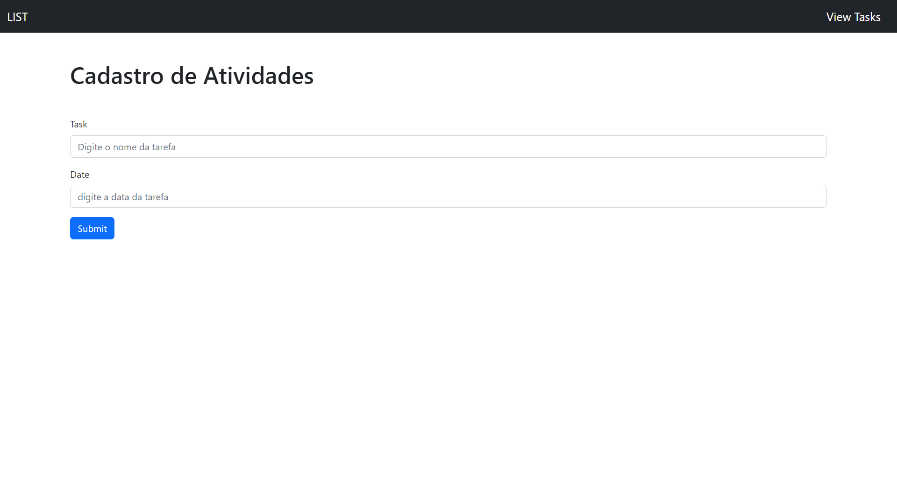

# <div align="center">Todo List JQuery</div>

<a href="https://todo-list-jquery-eta.vercel.app/">
</a>
<a href="hthttps://todo-list-jquery-eta.vercel.app/">
</a>
<a href="https://todo-list-jquery-eta.vercel.app//">
</a>
<p align="center">A Responsive Todo List made with Jquery, bootstrap e Date Mask.</p>

## 🛠️ Technologies

<ul>
  <li><a href="https://jquery.com/">Jquery</a></li>
  <li><a href="https://getbootstrap.com/">bootstrap</a></li>
  <li><a href="https://igorescobar.github.io/jQuery-Mask-Plugin/docs.html">Date mask</a></li>
</ul>

## ⚙️ Requirements

<ul>
  <li><a href="https://git-scm.com/">Git</a></li>
  <li><a href="https://nodejs.org/en/">Node.js</a></li>
  <li><a href="https://www.npmjs.com/">NPM</a></li>
</ul>

## 🚀 Installation

```
$ git clone https://github.com/Hudson3384/todo-list-Jquery.git

```

## Author

 [<br><sub>Hudson Arruda Ribeiro</sub>](https://github.com/hudson3384) 
/
